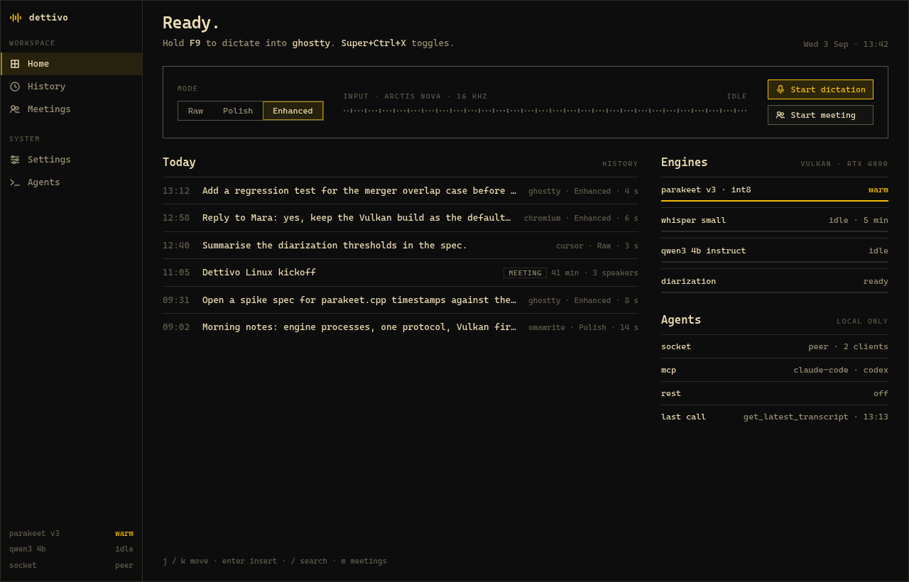
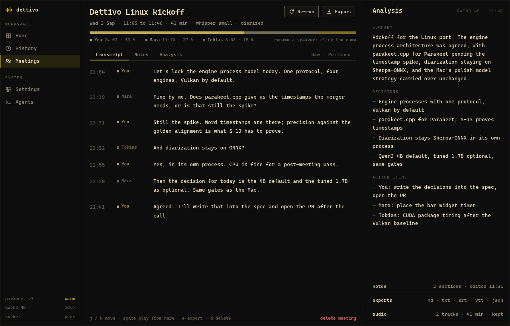

# Dettivo for Linux

Hold `F9`, talk, let go, and your words land in the window you were typing in. Dettivo is a speech workstation for the Linux desktop. It handles dictation, meeting transcription with speaker names, and a searchable history of everything you said, and it runs every model on your own machine. Audio and text leave the machine only when you point Dettivo at an endpoint yourself.

It is built for Omarchy and Hyprland first. It lives in the Omarchy bar, follows the active theme on every surface, and takes the `F9` chords Omarchy already binds for dictation. It also runs on Sway, Niri and any desktop whose portal offers global shortcuts.



## What you get

- **Dictation into any app.** Hold to talk or toggle a longer take. Text goes in through the Wayland virtual keyboard, or a paste where the window refuses it, and always to the window that had focus when you pressed the key.
- **Three modes.** Raw keeps the engine's words, with file names, paths and URLs kept byte for byte. Polish fixes grammar, fillers and punctuation with a preset per app. Enhanced adds a rewrite by a local language model and falls back to the polished text if the model does not answer in time.
- **Meetings without a bot.** Your microphone and the call's audio are recorded as two tracks on one clock and transcribed live. At stop Dettivo builds the full transcript, names the speakers, and writes a summary, decisions and action items beside your notes. Exports go to md, txt, srt, vtt or json. A headset that drops, a daemon crash or a reboot leaves a meeting you can recover.
- **History you can search.** Every dictation and meeting is kept with its audio, full-text searchable, re-runnable with another model and exportable.
- **Agents can use it.** One command registers Dettivo as an MCP server in Claude Code, Codex, Cursor or Claude Desktop, with nineteen tools to search transcripts, insert text or start a dictation. The `dettivo` CLI speaks `--json`, and an optional REST shim listens on loopback.
- **Configuration is a file.** `~/.config/dettivo/config.toml` holds every setting. The app's Settings screen edits the same file and keeps your comments.



## Requirements

- An x86_64 Linux machine with Qt 6.8 or newer, running PipeWire. The ready-made package is for Arch Linux, Omarchy and other Arch-based distributions; elsewhere you build from source (see [Other distributions](#other-distributions)).
- A Wayland session. Hotkeys work out of the box on Hyprland, Sway and Niri, and through the GlobalShortcuts portal on GNOME and KDE.
- A GPU is optional. The engines use Vulkan when a driver is installed and fall back to the CPU with smaller default models. `dettivo doctor` tells you which tier your machine is on.
- Disk for the models you pick. The catalogue downloads them on first run, checks every file against a pinned checksum, and resumes interrupted downloads ([docs/models.md](docs/models.md)).

## Install

On Arch Linux, Omarchy and other Arch-based distributions:

```bash
# the pacman package from the latest release
url="$(curl -s https://api.github.com/repos/gmickel/dettivo-linux/releases/latest | grep -o 'https://[^"]*dettivo-bin-[^"]*x86_64\.pkg\.tar\.zst' | head -1)"
curl -LO "$url" && curl -LO "$url.sha256"             # the package and its checksum
sha256sum --check "${url##*/}.sha256"                # the file CI installed and tested
sudo pacman -U "./${url##*/}"                        # a local file: pacman needs no signature
systemctl --user enable --now dettivod.socket   # the daemon starts on the first request
dettivo setup omarchy                           # keys, bar plugin and recording pill on Omarchy
dettivo doctor                                  # what is installed, what is missing, which tier this machine is
```

Every release on the [Releases page](https://github.com/gmickel/dettivo-linux/releases) carries that package, `dettivo-bin-<version>-1-x86_64.pkg.tar.zst`, with its checksum beside it. It is the same package CI installs and tests in a clean Arch container before the release goes out.

**Why not the AUR yet:** Dettivo belongs on the AUR as `dettivo-bin` and `dettivo`, and the recipes and the publishing job are ready. In September 2026 the AUR paused new account registration while its team deals with a wave of automated sign-ups, so the account that publishes Dettivo can't be created yet. Until registration reopens, pacman won't update Dettivo for you, so install each new release with the same command. Once the AUR packages are up, `yay -S dettivo-bin` takes over and updates arrive with the rest of your system.

On plain Hyprland, Sway or Niri, run `dettivo setup hyprland` (or `sway`, `niri`) in place of the Omarchy line. It writes the binding snippet and prints the one include line to add. [docs/install.md](docs/install.md) lists every installed file and the optional CUDA engine for speaker detection on NVIDIA.

### Other distributions

Dettivo isn't tied to Arch. It needs Qt 6.8 or newer, PipeWire and a Wayland session. The ready-made package is only built for Arch so far, though, because it links against Arch's own Qt and system libraries. On Fedora, openSUSE Tumbleweed, Ubuntu, Debian and other distributions, [build from source](#building-from-source). Check first that your distribution ships Qt 6.8 or newer. Hotkeys work the same way there: `dettivo setup sway` or `dettivo setup niri` for those compositors, and the GlobalShortcuts portal on GNOME and KDE.

Two honest caveats. Builds outside Arch haven't been tested yet, and there's no documented system-wide install from a source build yet, so you run it from the build tree. Packages for other distributions may follow. If you try it, an [issue](https://github.com/gmickel/dettivo-linux/issues) saying what worked and what didn't helps.

## First run

Open Dettivo from the launcher. When something is missing, three screens walk you through it.

1. **Keys** shows the binding snippet and confirms your key press live.
2. **Models** recommends a speech model for your hardware and downloads it.
3. **Try it** dictates into the screen itself, so you see where the words went and how long it took.

After that, these keys work in every app:

| Key | Does |
|---|---|
| Hold `F9` | Dictate while held; the text lands on release |
| `Super+Ctrl+X` | Start or stop a longer take |
| `Super+Ctrl+Escape` | Cancel the take |
| `Super+Ctrl+Shift+X` | Insert the last transcript again |

`[hotkeys]` in `config.toml` changes any chord. The [user guide](docs/guides/user.md) covers modes, history, meetings, settings and troubleshooting.

## Documentation

| Guide | For |
|---|---|
| [User guide](docs/guides/user.md) | Install, first run, dictate, the modes, history, meetings, settings, and what to do when something fails |
| [Omarchy guide](docs/guides/omarchy.md) | The bar, the panel, `dettivo setup omarchy`, themes, keys and plugin updates |
| [Agent guide](docs/guides/agents.md) | The `dettivo` command tree, `--json` and exit codes, MCP per host, REST and the capability flags |
| [QA guide](docs/guides/qa.md) | The test rig, the packs, visual checks, benchmarks and the release gate, for contributors |

Every topic has its own reference page:

| Page | Covers |
|---|---|
| [docs/dictation.md](docs/dictation.md) | A dictation session, the raw text pipeline, the event stream and `dettivo dictation` |
| [docs/polish.md](docs/polish.md), [docs/polish-models.md](docs/polish-models.md) | The polish layers, per-app presets, the local language model and fine-tunes |
| [docs/insertion.md](docs/insertion.md) | How text reaches the focused window, the fallbacks, and undo |
| [docs/hotkeys.md](docs/hotkeys.md) | Bindings for Hyprland, Sway and Niri, the portal and evdev backends |
| [docs/osd.md](docs/osd.md) | The recording pill, its states and its settings |
| [docs/meetings.md](docs/meetings.md) | Two-stream capture, live transcription, recovery, speakers, notes and analysis |
| [docs/history.md](docs/history.md) | The history store, search, export, re-runs and retained audio |
| [docs/models.md](docs/models.md), [docs/engines.md](docs/engines.md) | The model catalogue and verified downloads; the engine processes and GPU fallback |
| [docs/config.md](docs/config.md) | Every configuration key with its default |
| [docs/daemon.md](docs/daemon.md) | The daemon, its socket, logs and the `dettivo` command |
| [docs/app.md](docs/app.md), [docs/omarchy.md](docs/omarchy.md) | The app's routes, theme sources and desktop entry; the bar widget and panel |
| [docs/mcp.md](docs/mcp.md), [docs/rest.md](docs/rest.md) | MCP for Claude Code, Codex, Cursor and Claude Desktop; the loopback REST shim |
| [docs/install.md](docs/install.md), [docs/RELEASING.md](docs/RELEASING.md) | What the packages install and how a release is gated and published |
| [docs/qa.md](docs/qa.md) | The QA rig: drivers, isolated profiles, the virtual audio rig and the packs |
| [docs/adr/](docs/adr/README.md) | Every architecture decision, why it was made and what it costs |
| [docs/design/](docs/design/README.md) | The design system and the approved visual baselines |

## Building from source

```bash
just build     # every Rust crate and every Qt binary
just test      # Rust unit tests and Qt smoke tests
just lint      # rustfmt, clippy, crate edges, file length, QML lint, docs
just package   # the release tree under dist/ as a tarball
```

You need Rust 1.85 or newer with rustfmt and clippy, CMake, Ninja, a C++20 compiler, Qt 6.8 or newer and `just`. On Arch that is `pacman -S rust cmake ninja qt6-base qt6-declarative qt6-svg qt6-wayland qt6-multimedia jq just`. The Vulkan engine builds also need `vulkan-headers` and `shaderc`. `just build` names any missing piece and stops before compiling.

The code is a Rust daemon (`crates/dettivod`) that owns one JSON-RPC contract, with every interface as a client of it: the Qt 6 Quick app, pill and bar under `qt/`, the Omarchy plugin under `omarchy/`, the CLI, MCP and REST. Speech recognition (whisper.cpp and parakeet.cpp), the language model (llama.cpp) and speaker detection (sherpa-onnx) run in supervised engine processes, so a crash in native code never takes the daemon down. [STRATEGY.md](STRATEGY.md) sets out the problem and the approach, and [CONTRIBUTING.md](CONTRIBUTING.md) explains how to report a bug. The project doesn't take code contributions.

## Privacy

Dettivo sends no telemetry and makes no network calls you did not configure. Model downloads go only to the hosts the catalogue pins. The language model runs locally unless you trust an endpoint yourself, and the REST shim listens on loopback only, behind a token, and is off by default. Logs never contain transcript text or audio.

## License

Copyright 2026 Gordon Mickel. Dettivo for Linux is free software under the GNU General Public License, version 3 or (at your option) any later version; see [LICENSE](LICENSE). You can use, study, change and share it, and anything you distribute that is built on it must be released under the same licence with its source. [NOTICE.md](NOTICE.md) lists the components the binaries bundle and their licences.
