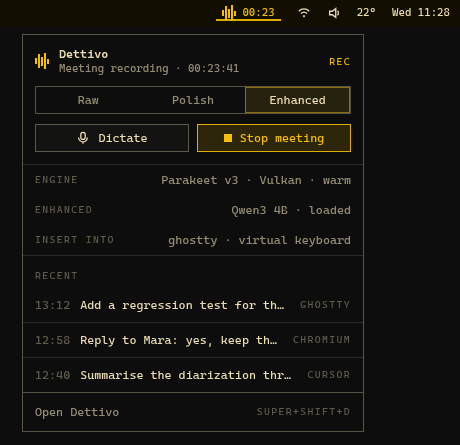

# Omarchy guide

On Omarchy, Dettivo is one command away from living in the bar with the keys you already know: `dettivo setup omarchy` enables the daemon's socket, writes the Hyprland bindings, installs the bar plugin and reloads the shell, and from then on the 16 px mark in the bar shows what the daemon is doing, its panel hosts the recording pill, and every colour, size and spacing follows the active theme. This guide walks that path and links the pages that hold the details.




## One command

```
dettivo setup omarchy            # the socket, the bindings, the plugin, the reloads
dettivo setup omarchy --check    # every step reported: socket, snippet, plugin
dettivo setup omarchy --stdout   # print what it would write and run
```

The setup is idempotent; a second run changes nothing, by hash over the snippet, the installed plugin folder and the socket unit ([docs/omarchy.md](../omarchy.md#install)). `--no-plugin` keeps the bindings and leaves the bar alone; `--git <url>` adds the plugin from the mirror repository instead of the installed folder.

## The keys

The defaults are the chords Omarchy bound to Voxtype, so nothing has to be relearned: hold `F9` to talk, `Super+Ctrl+X` to toggle a take, `Super+Ctrl+Escape` to cancel, `Super+Ctrl+Shift+X` to insert the last transcript again. The snippet under `~/.config/hypr/` unbinds Omarchy's two chords first and loads after Omarchy's defaults; `[hotkeys]` in `config.toml` changes any chord and `dettivo setup omarchy` writes the snippet again ([docs/hotkeys.md](../hotkeys.md#omarchy-in-one-command)).

## The bar widget and the panel

The mark in the bar's right section shows idle, listening with the bars following your voice, transcribing, a meeting with its elapsed time, or an error, and takes the bar's active underline while a take runs. A click opens the panel: the state, the mode, Dictate and the meeting action, which engine, language model and insertion backend are in force, the last dictations, and Open Dettivo with its shortcut ([docs/omarchy.md](../omarchy.md#the-bar-widget)). `[omarchy]` in `config.toml` picks the glyph, the level meter, the pill host, how many recent dictations the panel lists and the shortcut label ([docs/config.md](../config.md#omarchy)).

## The pill

With `[omarchy] osd = "panel"` the plugin hosts the recording pill inside the shell and `dettivo-osd.service` exits with a notice, so one pill shows; `osd = "service"` keeps the standalone pill on its layer-shell overlay, `off` shows none ([docs/osd.md](../osd.md#hosting)). The pill's six states, its position and its timing are on [docs/osd.md](../osd.md).

## Themes

Every surface resolves its colours, sizes and spacing from the active theme's `colors.toml` and the font Omarchy installs; `omarchy theme set` is picked up on the next frame without a restart, in the app, the pill and the bar alike ([docs/app.md](../app.md#theme), [ADR 0010](../adr/0010-studio-design-system.md)). Outside Omarchy the built-in dark and light palettes follow the portal's colour scheme.

## Plugin updates

The plugin is a folder in this repository, installed under `/usr/share/dettivo/omarchy` by the package and mirrored to `gmickel/omarchy-dettivo` for `omarchy plugin add`; a package update carries the new folder and `dettivo setup omarchy` installs it again, while a mirror install updates through Omarchy's own plugin update ([docs/omarchy.md](../omarchy.md#the-plugin-folder-and-the-mirror), [ADR 0030](../adr/0030-omarchy-plugin-in-repo-folder-mirror-and-panel-hosted-pill.md)). The plugin carries no state of its own; it reads `[omarchy]` through `dettivo config get` and writes it through `dettivo config set`.

## Proving it

`just qa-pack gui-omarchy` runs the plugin lint, the shim load, the version-skew test and the two desktop drives as one pack; `DETTIVO_QA_OMARCHY_LIVE=1` lets the drives touch the live desktop ([docs/omarchy.md](../omarchy.md#proving-it), [docs/guides/qa.md](qa.md)).
