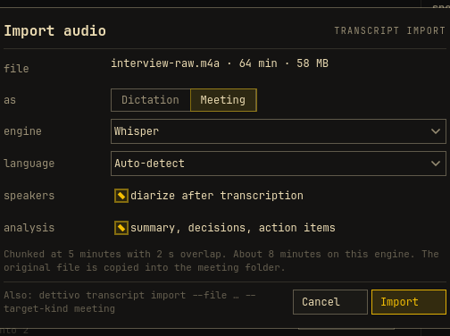
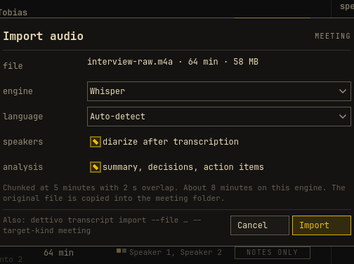
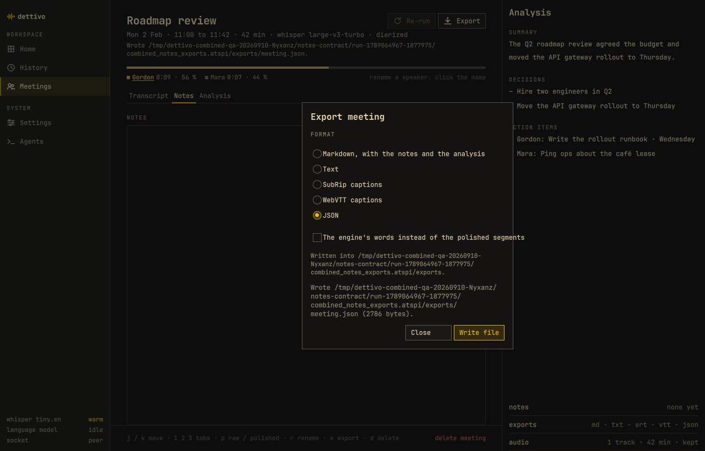

# Combined cleanup QA, 2026-09-10

The security, correctness and final simplification tasks are complete. The release app passes the 25 drivable workflow scenarios and the 84-route GUI pack. Native memory and startup still fail the required reference, so fn-55 remains blocked and the combined QA verdict is **NEEDS_WORK**. This report supports one draft PR for fn-48, fn-53, fn-55 and fn-52.

## Scope and identity

fn-48 fixed all six security findings. fn-53 fixed 30 findings and rejected three against existing correct behavior. fn-55's interrupted implementation was recovered, verified and committed as a coherent partial. fn-52 ran last and records a disposition for all 29 findings. The tracked task summaries contain each finding's regression evidence and decision; this report adds the combined live pass.

| Spec | Task state | Evidence record |
|---|---|---|
| fn-48 | Done | [Security task](../../../.flow/tasks/fn-48-cleanup-security-boundaries-6-review.1.md) |
| fn-53 | Done | [Correctness task](../../../.flow/tasks/fn-53-cleanup-other-33-review-findings.1.md) |
| fn-55 | Blocked on R2 and R5 | [Memory report](2026-09-10-desktop-memory.md) |
| fn-52 | Done | [Simplification task](../../../.flow/tasks/fn-52-cleanup-delete-and-simplify-29-review.1.md) |

Flow therefore has 71 of 77 criteria claimed by completed tasks. The six fn-55 criteria belong to its still-blocked task; R1, R3, R4 and R6 are implemented, while R2 and R5 remain unmet. The separate fn-38 human design checkpoint is unchanged. No planning, model review, review bot, merge, installation or release ran in this continuation.

The combined base is `b7fa002043854b438aa42b195d963908eb53de8c`. Final product and QA code is `f324e285a57e02142d6f3d04d486438b15d48880`; release companions embed that revision. The subsequent `258cb001a97ab4532863132f5c8195319f52d6ba` changes only the fn-52 task receipt. Combined runtime checks ran on those binaries. The [evidence JSON](2026-09-10-combined-cleanup.json) preserves binary SHA-256 values, all 77 R-ID mappings, scenario outcomes and exact local evidence paths. Later QA documentation and receipt commits do not change the tested product code.

## Verification

| Check | Observed result |
|---|---|
| `just build test lint` at f324e285 | Exit 0; 1,000 Cargo tests and 78/78 CTest entries pass. ShellCheck remains unavailable and explicitly skipped. |
| Strict release contract replay | Exit 0; socket 88 pass, 45 documented skips, six pending methods admitted by false capability flags; MCP 48 pass; REST 55 pass. |
| Full release AT-SPI workflow run | Exit 0; 25 pass, zero fail, four documented skips. History search, import and same-ID Cancel/Recover pass. |
| Release GUI pack | Exit 0; all 84 routes pass, zero text findings, accessible-name ratio 1.000. Two installed-Omarchy checks remain skipped. Supported AT-SPI and CUA steps pass. |
| Supplemental live notes probe | Search and clearing restore the expected rows. Closing an unwritten export creates no file. Nonempty, empty and whitespace editor overrides all beat another client's stored notes. |
| Release Xvfb timing | First frame 236 ms with the timing gate enabled; theme application 7 ms, observed in 10 ms, against 100 ms. |
| Five native Wayland reference launches | Fail. First launch exceeds both memory caps; every first frame exceeds 300 ms. |
| Five private Xvfb reference launches | All pass. Maximum first frame 238 ms. |
| Full visual matrix | Exit 1; 310 pass, 190 fail, 90 awaiting first approval, zero style findings. |

Runtime checks used fresh seeded private profiles. They did not write personal configuration or use personal recordings. Builds finished before the accepted runtime runs; memory series ran sequentially with no other QA or build job alongside them. Component keyboard/QAccessible checks and shell-shim tests remain distinct from installed-session coverage.

The standard workflow skips are `hotkeys_hyprland`, `omarchy_bar` and `omarchy_setup_idempotent` outside an installed Hyprland test session, plus `meeting_token_coverage` without `diarization-en`. The later native memory run measures the reference app and does not fill those installation gaps.

## Native blocker after startup cleanup

The reference remains 1280 by 820 logical pixels on Thor, OpenGL, builtin-dark and five continuously observed idle seconds. Native DP-3 uses unchanged DPR 1.25; private Xvfb uses DPR 1. The limits remain RSS at most 262,144 KiB, anonymous memory at most 98,304 KiB and first frame strictly under 300 ms. PSS is reported without a cap. Only the app process is measured.

| Mode | Maximum RSS KiB | Maximum PSS KiB | Maximum anonymous KiB | Five first frames, ms |
|---|---:|---:|---:|---|
| Native Wayland | 275888 | 190696 | 104024 | 347, 334, 322, 329, 322 |
| Private Xvfb | 230028 | 169601 | 83508 | 238, 145, 146, 146, 147 |

Native launch 1 exceeds RSS by 13,744 KiB and anonymous memory by 5,720 KiB. Its values are 269.42 MiB RSS and 101.59 MiB anonymous memory. Later native launches pass both memory limits. All five native startup samples fail. The [complete post-cleanup record](2026-09-10-desktop-memory-post-cleanup.json) includes each sample's process identity, display metadata, idle observations and timing clocks. The earlier old-app control and failed measurements remain in the memory report. This pass establishes no allocation or timing root cause and does not select a green result from repeated unchanged runs.

## Visual results and open appearance work

Compared with fn-53, 580 of 590 rendered PNGs are byte- and pixel-identical. The ten changed images are the meeting import dialog across five themes and two scales. fn-52 removed its unsupported destination selector. The matrix gains 83 failure verdicts: 77 on unchanged pixels detected by the stricter comparator, and six on the changed import renders. Every failure and missing approval remains recorded. Independent unchanged/colour/type/spacing comparisons verify the comparator's sensitivity.

| Import before fn-52 | Import after fn-52 |
|---|---|
|  |  |

These are fixture renders, retained as evidence rather than approved baselines. No renderer policy, reference image, visual tolerance or fn-38 approval changed.

The supplemental live export check found one separate P2 cosmetic defect. The raw-text checkbox is 393 pixels wide inside a 352-pixel content column; its label extends beyond the sheet border in two fresh observations. Export content is correct. The [finding](../../../.flow/memory/bug/ui/meeting-export-option-text-extends-2026-09-10.md) records the steps and geometry. It remains open and is outside the requested cleanup findings.

## Failures retained during verification

The initial final release run failed History search because input arrived before focus settled. An old-app/current-app comparison reproduced it on both apps. Six focus-acknowledgment diagnostics passed at the original typing pace. The helper also substituted requested text after read errors, falsely treating an unobserved value as delivered. The repair acknowledges editable-field focus and requires actual field content. Persistent read errors remain errors.

A clean full run then failed import during AT-SPI traversal after transcription succeeded; the unchanged focused retry also failed. The repair permits one immediate fresh complete walk for `UnknownObject`. A second failure or permanent error still fails, and partial trees are rejected. Regression tests went red to green. Three unchanged import runs and the final complete workflow run pass. The original failures remain in `/tmp/fn52-input-final-live/` and `/tmp/fn52-input-import-retry/`.

An earlier full run overlapped a Qt build and hit launch/timing failures. That orchestration error is retained as failed/inconclusive in `/tmp/fn52-input-all-live/`. It is not acceptance evidence. The final accepted run started after the canonical gate and release build completed.

The temporary notes probe required two corrections. Its first two runs clicked the editor before the modal sheet finished closing; the focus guard rejected both. After waiting for observable dismissal, the next run reached export but expected an explicit empty JSON string. The existing fixture requires the notes member to be absent for empty or whitespace overrides. The corrected probe follows that contract and additionally requires a fresh file write, so a stale prior export cannot pass. It preserves nonempty notes exactly and rejects the alternate client's notes in every case. All failed probe sources, binaries, screenshots and logs remain beside the final result under `/tmp/dettivo-combined-qa-20260910-Nyxanz/`.

The first post-cleanup native command lacked `WAYLAND_DISPLAY` and captured no samples. The existing compositor instance exposed `wayland-1`; the subsequent command targeted that socket and produced the failed five-launch native reference above. Both command results remain retained.

The first additional gate over the assembled QA records passed the code tests but failed the docs self-test. That test copies tracked paths; the newly linked report files were still unstaged and therefore absent from its isolated copy. The exact QA outputs were staged before the retry. `/tmp/dettivo-combined-qa-20260910-Nyxanz/final-gate.log` retains that failed attempt. The staged retry exited 0 with 1,000 Cargo tests and 78/78 CTest entries; `final-gate-staged.log` and `.exit` retain its result. Every release binary still matches the SHA-256 recorded for live QA.

Earlier gate failures and focused repairs remain in the task evidence. The final f324e285 gate supersedes them for current-code verification, without changing their recorded outcomes. Historical visual differences, ShellCheck absence, unavailable installed integration and the untested real diarization fixture remain explicit limitations.

## Evidence locations

- Final code gate: `/tmp/fn52-input-tree-final-gate.log` and `.rc`.
- Release identity and strict contract: `/tmp/fn52-input-complete-binaries.json` and `/tmp/fn52-input-complete-contract.json`.
- Final complete workflow: `/tmp/fn52-input-complete-live/` and `/tmp/fn52-input-complete-live.log`.
- Combined GUI, notes, timing, memory and visual evidence: `/tmp/dettivo-combined-qa-20260910-Nyxanz/`.
- Final fn-52 dispositions and merged repair evidence: `/tmp/fn52-input-fix-handover.md` and `/tmp/fn52-input-fix-evidence.json`.

The committed JSON reports and selected unmodified screenshots make the principal results reviewable from the PR. Full logs and intermediate failed evidence remain local. The outstanding native resource/startup requirements and visual approvals prevent a completion claim for the combined scope.
